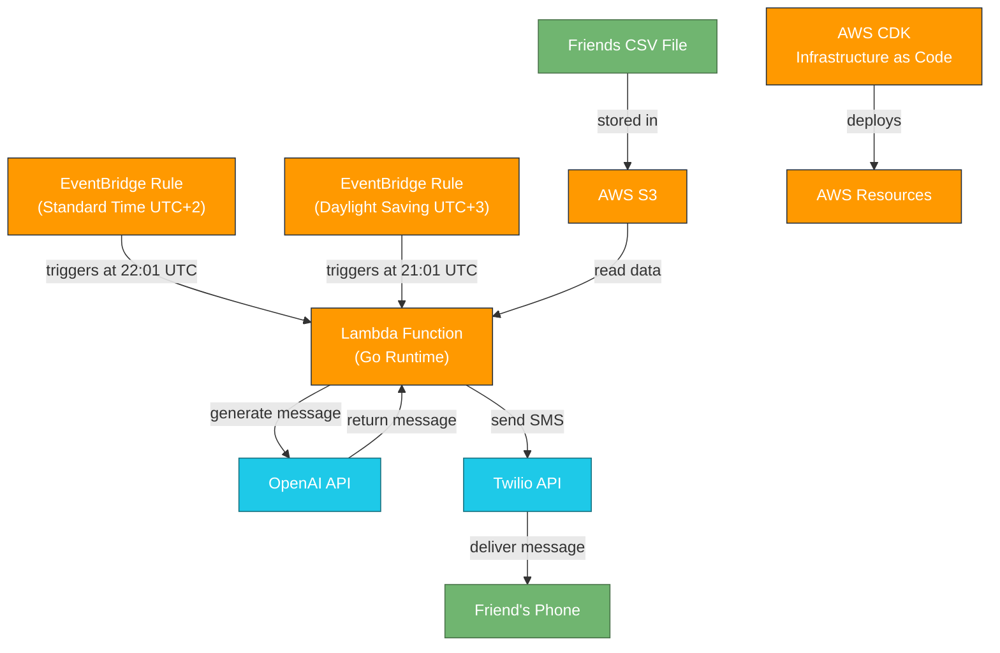

# Birthday Wisher

An automated birthday greeting system that sends personalized AI generated SMS messages using AWS Lambda and EventBridge.

## Overview

Birthday Wisher is a serverless application that automatically sends personalized birthday messages to friends via SMS. It uses:

- AWS Lambda (Go runtime)
- AWS EventBridge for scheduling
- OpenAI API for generating personalized messages
- Twilio for sending SMS messages
- AWS S3 for storing friend data (in production)

## Architecture

The system architecture follows this flow:



## Features

- Daily check for upcoming birthdays
- Personalized message generation based on friends' interests
- SMS delivery through Twilio
- Support for handling daylight saving time changes

## Reply Functionality

The system includes a reply Lambda function that can process incoming SMS replies from friends. When a friend responds to a birthday message,
the reply is received via Twilio and forwarded to the Lambda function. This function can generate automated responses using AI.
You can set special prompt for replies in the `friends.csv` file, which will be used to generate a response based on the friend's reply.

## AWS Roles and Security

To run Birthday Wisher in AWS, you must configure IAM roles with the following permissions:

- **Lambda Execution Role**: Grants access to read from S3, write logs to CloudWatch, and invoke other AWS services as needed.
- **S3 Access**: Allows Lambda to read the friends.csv file from the S3 bucket.
- **Secrets Manager (optional)**: If you store API keys (OpenAI, Twilio) in AWS Secrets Manager, grant permission to read those secrets.
- **EventBridge Permissions**: Allows Lambda to be triggered by scheduled EventBridge rules.

**Required AWS IAM roles and permissions for Lambda, S3, EventBridge, and API Gateway are automatically set up in the CDK code.**

## Project Structure

```
birthday-wisher/
├── cdk/                # AWS CDK infrastructure code
├── lambda/             # Lambda function code
│   ├── birthday/       # Main Lambda function
│   └── utils/          # Shared utilities
├── data/               # Local data (friends.csv)
└── .env                # Environment variables (local development)
```

## Setup

### Prerequisites

- Node.js and npm
- Go 1.16+
- AWS CLI configured
- AWS CDK installed
- OpenAI API key
- Twilio account with SID, auth token, and phone number

### Environment Variables

Create a `.env` file in the project root. You can take `.env.example` as a template:

```
# AWS Variables
AWS_ACCESS_KEY_ID=YOUR_AWS_ACCESS_KEY_ID
AWS_SECRET_ACCESS_KEY=YOUR_AWS_SECRET_ACCESS_KEY
AWS_DEFAULT_REGION=YOUR_AWS_DEFAULT_REGION

# OpenAI Variables
OPENAI_API_KEY=YOUR_OPENAI_API_KEY

# Twilio Variables
TWILIO_ACCOUNT_SID=YOUR_TWILIO_ACCOUNT_SID
TWILIO_AUTH_TOKEN=YOUR_TWILIO_AUTH_TOKEN
TWILIO_PHONE_NUMBER=YOUR_TWILIO_PHONE_NUMBER
```

### CSV Format

The application reads friend data from a CSV file with the following format:

```
name,birthday,phone,interests,prompt
John Doe,1990-01-01,+1234567890,"running, reading, music",Keep it friendly and casual
```

## CDK Deployment

This project uses AWS CDK (Cloud Development Kit) to define and deploy infrastructure as code. The CDK stack provisions resources such as Lambda functions, S3 buckets, and API Gateway for Twilio integration. 

To deploy the infrastructure:

1. Install dependencies:
   ```bash
   cd cdk
   npm install
   ```
2. Bootstrap your AWS environment (if not done before):
   ```bash
   cdk bootstrap
   ```
3. Deploy the stack:
   ```bash
   cdk deploy
   ```

You can find the CDK code in the `cdk/lib/birthday-wisher-stack.ts` file. Adjust environment variables and resource properties as needed for your use case.

## Local Development

```bash
# Run tests (note: tests do not verify functionality, just help to check different integrations)
cd lambda/birthday
go test -v ./...

# Set IS_LOCAL environment variable to true, if you want to run the function locally
export IS_LOCAL=true

# Run the function locally
go run main.go
```

## Time Handling

The application handles timezone differences between UTC and Finland (UTC+2/UTC+3):
- Two EventBridge rules are used to handle daylight saving time changes:
    - Standard time (UTC+2): Runs at 22:01 UTC
    - Daylight saving time (UTC+3): Runs at 21:01 UTC

The Lambda function sends birthday messages one day in advance of the actual birthday.

## License

[MIT License](https://opensource.org/license/MIT)
